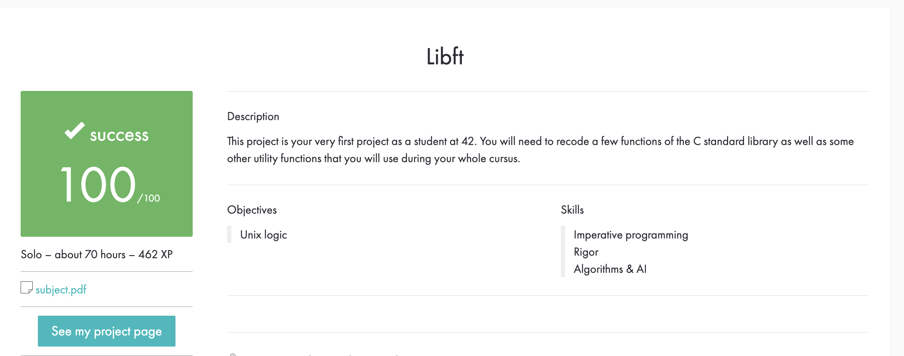

# My_Libft

Моя реализация некоторых функций стандартной библиотеки C

Что такое libft?
Libft - это отдельный проект в ecole 42, который требует от нас воссоздания некоторых стандартных функций библиотеки C, которые можно использовать позже для удобства написания проектов.

Проект создан только для того, чтобы мы могли глубже понять структуры данных и основные алгоритмы. В 42 нам не разрешено использовать некоторые стандартные библиотеки в наших проектах, поэтому мы должны продолжать расширять эту библиотеку за счет наших собственных функций по мере продвижения по программе.

# Запуск

make и make all - собирает библиотеку.

make re - удаляет все .o файлы, удаляет libft.a, пересобирает библиотеку.

make clean - удаляет все .o файлы.

make fclean - удаляет все .o файлы, также удаляет libft.a.

# Оценка

